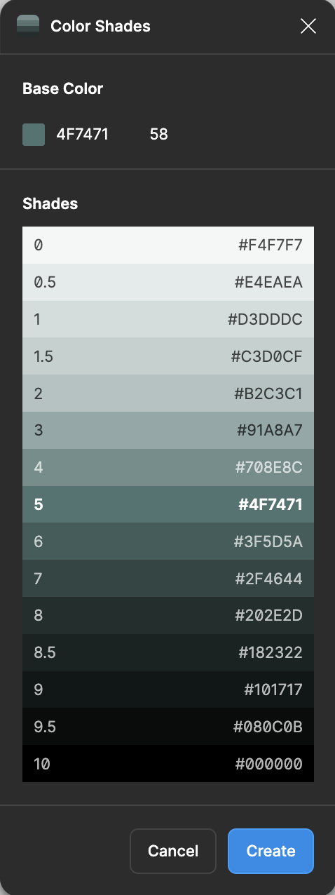
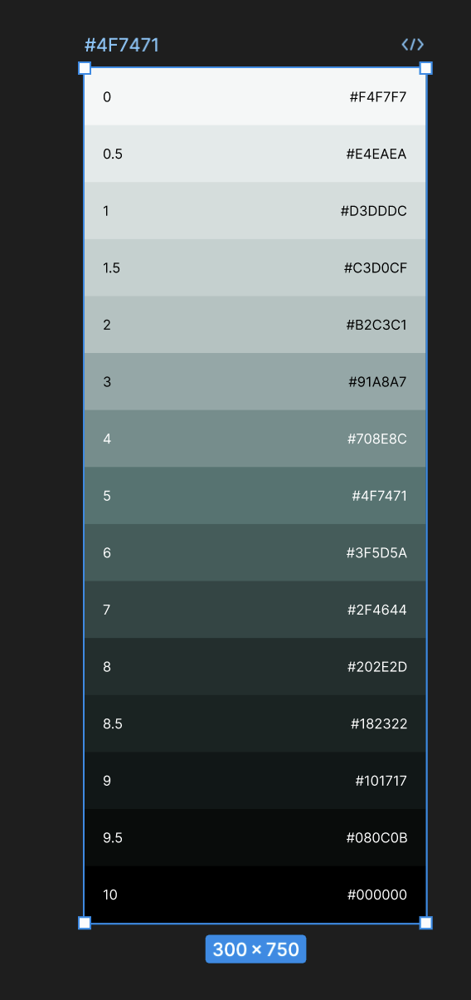
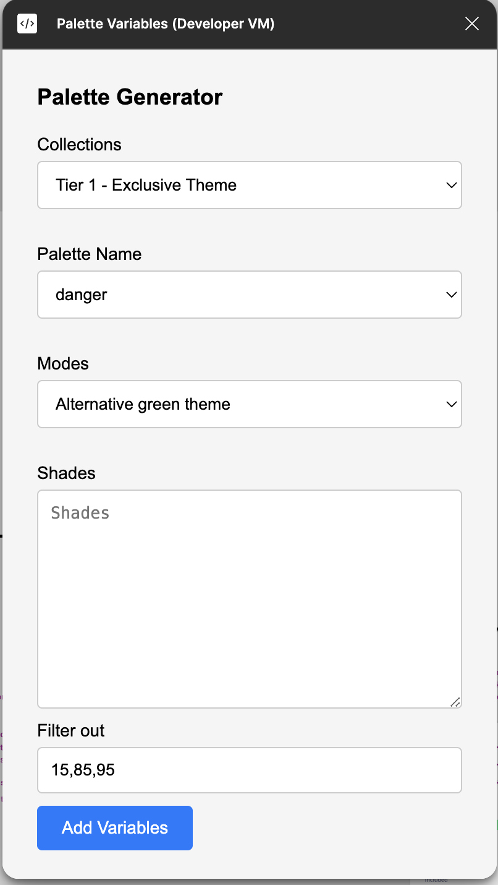

# Otter Figma plugin for color palettes in local variables (V1) - User guide

## Introduction
The Otter Figma plugin helps you manage color palettes in local variables. Follow these steps to use the plugin effectively.

## Prerequisites
- You'll need the [Color Shades](https://www.figma.com/community/plugin/929607085343688745/color-shades) plugin to generate initial palettes.

## Steps to use the Otter plugin

1. **Generate color palettes**:
- Use the Color Shades plugin to create your color palettes.


- Copy the generated UI elements from the Figma page.


The output should have this format:
```
0
#F4F7F7
0.5
#E4EAEA
1
#D3DDDC
1.5
#C3D0CF
2
#B2C3C1
3
#91A8A7
4
#708E8C
5
#4F7471
6
#3F5D5A
7
#2F4644
8
#202E2D
8.5
#182322
9
#101717
9.5
#080C0B
10
#000000
  ```
2. **Open the Otter plugin**:
- Launch the Otter plugin in Figma.



3. **Configure the plugin**:
- Select values from the dropdowns for **Collections**, **Palette name**, and **Mode**. You can read more about these 3 entities on the [Figma documentation](https://help.figma.com/hc/en-us/articles/14506821864087-Overview-of-variables-collections-and-modes).
- Paste the copied values into the **Shades** input area.
- Filter out shades from the palette, if needed (default: **15, 85, 95**).

4. **Add variables**:
- Click the **"Add variables"** button to update the local variables with the new shades.

### Current limitations
- **Update only**: Currently, the plugin only supports updating existing variables. Creating new variables is not yet supported.
- **Future enhancements**: Future versions will support creating new variables and generating palettes directly within the Otter plugin.

## Conclusion
By following these steps, you can efficiently manage your color palettes in local variables using the Otter Figma plugin. Happy designing!

If you have any questions or need further assistance, feel free to [reach out](https://github.com/AmadeusITGroup/otter/issues).
