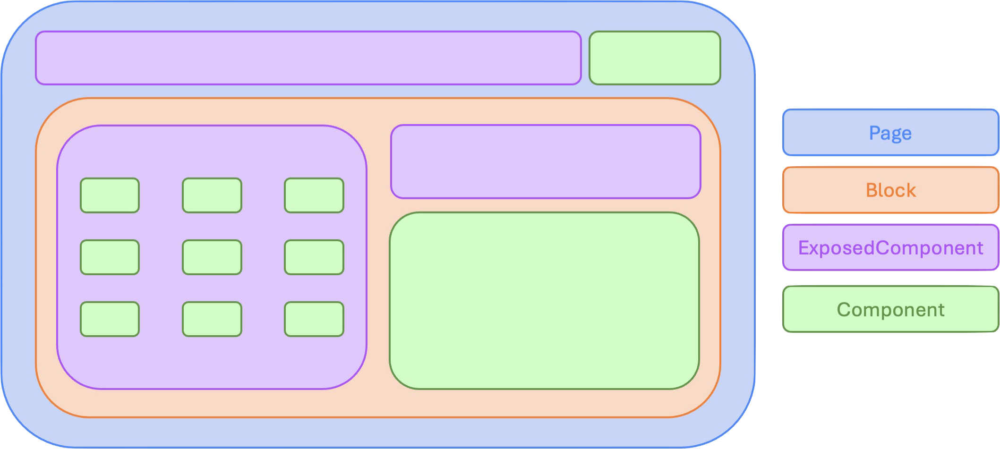

# Component introduction

A component refers to a modular, reusable piece of code that encapsulates specific functionality, styling, and behavior within a user interface (UI). Components are commonly used to build dynamic and interactive web applications, allowing developers to break down complex user interfaces into smaller, manageable parts.

## How to generate a component

```shell
ng g component <ComponentName> [--project-name <project-name>]
```

## Structure
Below you can see the basic files generated for a component (more files can be generated depending on the activated options):
- `component-name.component.ts` will contain the logic of the component
- `component-name.spec.ts` will contain component unit tests
- `component-name.style.scss` will contain the styling of the component
- `component-name.template.html` will contain the structure of the component

> [!NOTE]
> By convention, file names must be written in kebab-case


## Component class
Otter components are Angular components with Otter-specific information provided through the `@O3rComponent` decorator.
It will be used to extract metadata or for debugging purpose.

```typescript
@O3rComponent({
  componentType: 'Component'
})
@Component({
  selector: 'o3r-component-name',
  standalone: true,
  templateUrl: './component-name.template.html',
  styleUrls: ['./component-name.style.scss'],
  encapsulation: ViewEncapsulation.None,
  changeDetection: ChangeDetectionStrategy.OnPush
})
export class ComponentNameComponent {}
```

> [!NOTE]
> By convention, class names must be written in PascalCase and variable names in camelCase.

### Component type
The object passed to the `@O3rComponent` decorator includes the component type, which can be:
- `Page`: a component that displays an application route
- `Block`: a component that handles a functional area
- `ExposedComponent`: a component that needs to be exposed in your CMS
- `Component`: a component that does not need to be exposed in your CMS and that does not fit the others categories

Example:


## Runtime debugging

The Otter framework provides an [Otter Chrome Extension](https://chrome.google.com/webstore/detail/otter-devtools/aejabgendbpckkdnjaphhlifbhepmbne) to help debug an Otter application.
To enable the communication between your application and the Chrome Extension you can follow this [documentation](../dev-tools/chrome-devtools.md).

## Next steps

To provide [UI Test Fixtures](https://en.wikipedia.org/wiki/Test_fixture#Software) capabilities, you can refer to the [fixtures documentation](./FIXTURES.md).

In case you need to handle different UI flavors or to share a flavor with different logics, we recommend to use the [container / presenter](./CONTAINER_PRESENTER.md) patterns.

Different kind of customization could be applied to a component:

* [Configuration](../configuration/OVERVIEW.md)
* [Localization](../localization/LOCALIZATION.md)
* [Styling](../styling/THEME.md)
* [Design token](../design/TECHNICAL_DOCUMENTATION.md)
* [Analytics](../analytics/ANALYTICS.md)

In case you need to replace a component at runtime, you can have a look at the [component replacement](./COMPONENT_REPLACEMENT.md) mechanism.

In case you need to integrate dynamic HTML elements (with a basic rendering system) at a predefined position in the application, you can have a look at the [placeholder](./PLACEHOLDERS.md) mechanism.
