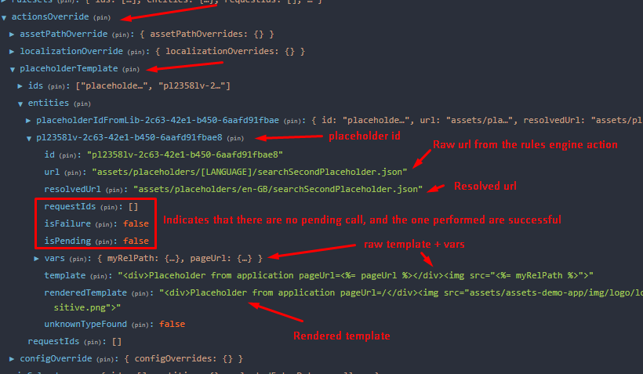

# Placeholder component

The Otter framework provides a placeholder component mechanism to help integrate dynamic HTML elements (with a basic
rendering system) at a predefined position in the application.

The placeholder component is exposed by the **@o3r/components** package and is working with the NgRX `placeholderTemplate`
store exposed by the same package.

The component only has 1 input and supports a *content value*.

- The `id` input is required and will determine the unique identification for a specific placeholder component.
- The *content value* (or child nodes), if provided, will be used by the placeholder component as default display when
  no template has been found.

## Supported features

- HTML limited to behavior supported by Angular sanitizer
- URLs (relative ones will be processed to add the `dynamic-media-path`)
- Facts references
- Dynamic translation

## How it works

Based on the `id` provided to the placeholder component, it will register itself to the event coming from `placeholderTemplate`
and will display the template corresponding to its ID in the store.

> [!IMPORTANT]
> It is **strongly encouraged** to use the placeholder mechanism in concert with the [Rules Engine](../rules-engine/README.md).

## How to define a placeholder template

The placeholder template is defined in a JSON file following the [JSON Schema](https://json-schema.org/) defined in [placeholder-template.schema.json](https://github.com/AmadeusITGroup/otter/blob/main/packages/%40o3r/components/schemas/placeholder-template.schema.json).

Example:

```json
{
  "template": "<p>My fact : <%= myFact %></p>",
  "vars": {
    "myFact ": {
      "value": "myFact",
      "type": "fact"
    }
  }
}
```

Then the JSON file can be downloaded and dispatched to the store as follows:

```typescript
import { setPlaceholderTemplateEntityFromUrl } from '@o3r/components';

const JsonFileUrl = 'url-to-the-json-file';

store.dispatch(setPlaceholderTemplateEntityFromUrl({
  call: (await fetch(JsonFileUrl)).json(),
  id: 'my-placeholder-template',
  resolvedUrl: JsonFileUrl,
  url: JsonFileUrl
}));
```

## How to integrate a placeholder in the application

The following steps should be followed in the application:

- Importing the `PlaceholderTemplateStoreModule` module in the application `AppModule`.
- Importing the `PlaceholderModule` module in the component using the placeholder in its template.

```typescript
import { PlaceholderModule } from '@o3r/components';

@NgModule({
  imports: [
    ...
      PlaceholderModule
  ],
  ...
})
export class MyComponentModule {
}

@Component({
  selector: 'my-component',
  template: `<p>the placeholder:</p><o3r-placeholder messagePanel id="pl2358lv-2c63-42e1-b450-6aafd91fbae8">Placeholder loading ...</o3r-placeholder>`,
  changeDetection: ChangeDetectionStrategy.OnPush
})
export class MyComponent {
}
```

The loading message is provided by projection. Feel free to provide a spinner if you need.

### How to generate placeholder metadata

Once your placeholder has been created, you will need to manually create the metadata file and add the path to the
`extract-components` property in your `angular.json`.
Metadata file example:

```json
[
  {
    "library": "@scope/app",
    "name": "ExampleComponent",
    "placeholders": [
      {
        "id": "pl2358lv-2c63-42e1-b450-6aafd91fbae8",
        "description": "Example component placeholder from app"
      }
    ]
  }
]
```

Then, in the `angular.json` file:

```json5
{
  //...
  "extract-components": {
    "builder": "@o3r/components:extractor",
    "options": {
      "tsConfig": "./tsconfig.cms.json",
      "libraries": [
        "@scope/components"
      ],
      "placeholdersMetadataFilePath": "placeholders.metadata.manual.json"
    }
  }
  //...
}
```

The placeholders will be merged inside the component metadata file that will be sent to the CMS.

### Static localization

The first choice you have when you want to localize your template is the static localization.
You need to create a localized template for each locale and provide the template URL with `[LANGUAGE]` (
ex: `assets/placeholders/[LANGUAGE]/myPlaceholder.json`)
The rules engine service will handle the replacement of `[LANGUAGE]` for you, and when you change language a new call
will be performed to the new 'translated' URL.

> [!NOTE]
> The URL caching mechanism is based on the url NOT 'translated', meaning that if you change from en-GB to
> fr-FR then you decide to switch back and all the calls will be done again.
> This behavior is based on the fact that a real user rarely goes back and forth with the language update.

### Dynamic localization

Your second option is to manage your placeholder in a single template and use the dynamic localization mechanism.

In that use case, you can refer to localization keys in your master placeholder template.
The module will then translate the template based on the localization service and keep it updated after every language
change.
As your placeholder URL remains the same, it will be updated dynamically without any server call.

#### Implementation

You can activate the dynamic localization feature in your placeholder by following this example:

```json
{
  "vars": {
    "keyToTranslation": {
      "type": "localisation",
      "value": "my-localisation-key"
    }
  },
  "template": "<div class=\"fancy-box\"><%= keyToTranslation %></div>"
}
```

Your key should be described in a placeholder variable where the type will be ``localisation`` and its value
the translation key itself. You can refer to the variable in your template thanks to the variable
key (``keyToTranslation`` in the example above).

**Note**: you should **not** create `[LANGUAGE]` files for placeholders that use the dynamic localization feature. The static localization is not compatible with the dynamic localization.

#### ICU and parameter support

Today, the Otter Framework supports the [ICU](https://icu.unicode.org/) syntax as well as parameters for localization variables.

As an example, let's create a counter that will emit every second.
You will first need to design your placeholder referencing the translation key and the facts it is bound to.

Let's consider what this placeholder would look like if it were completely integrated in your Angular component.

```html
<div style=\"border-radius:10%; background:red;\">{{'o3r-increment-key' | o3rTranslate}}</div>
```

Then, let's create a new localization key for each of your supported languages:

- en-GB.json

```json
{
  "o3r-increment-key": "{increment, plural, =1 {1 second has} other {{{increment}} seconds have}} elapsed since you opened the page"
}
```

- fr-FR.json

```json
{
  "o3r-increment-key": "Cela fait {increment, plural, =1 {1 seconde} other {{{increment}} secondes}} que tu as ouvert cette page"
}
```

Note that the ``o3r-increment-key`` translations take ``increment`` as a parameter.

This is how ``template.json`` should look like.

```json
{
  "vars": {
    "incrementKey": {
      "type": "localisation",
      "value": "o3r-increment-key",
      "parameters": {
        "increment": "incrementVar"
      }
    },
    "incrementVar": {
      "type": "fact",
      "value": "incrementFact"
    }
  },
  "template": "<div style=\"border-radius:10%; background:red;\"><%= incrementKey %></div>"
}
```

Now you will need to create an ``incrementFact`` fact to fill the value.
You can follow the [fact creation documentation](../rules-engine/how-to-use/custom-fact.md).

```typescript
import { Injectable } from '@angular/core';
import { Router } from '@angular/router';
import { FactsService, RulesEngineRunnerService } from '@o3r/rules-engine';
import { interval } from 'rxjs';
import { retrieveUrl } from './fact-factories/index';
import { PageFacts } from './page.facts';

@Injectable()
export class PageFactsService extends FactsService<PageFacts> {

  public facts = {
    incrementFact: interval(2000)
  };

  constructor(rulesEngine: RulesEngineRunnerService, private router: Router) {
    super(rulesEngine);
  }

}
```

#### JSONPath support

Thanks to the parameters map you can use fact variables with JSONPath in localization strings.

``en-GB.json``

```json
{
  "o3r-greet-key": "Welcome back, { firstName } { lastName }!"
}
```

``template.json``

```json
{
  "vars": {
    "greetKey": {
      "type": "localisation",
      "value": "o3r-greet-key",
      "parameters": {
        "firstName": "firstNameVar",
        "lastName": "lastNameVar"
      }
    },
    "firstNameVar": {
      "type": "fact",
      "value": "user",
      "path": "$.firstName"
    },
    "lastNameVar": {
      "type": "fact",
      "value": "user",
      "path": "$.lastName"
    }
  },
  "template": "<div><%= greetKey %></div>"
}
```

### Multiple templates in same placeholder

You can use placeholder actions to target the same placeholderId with different template URLs.
It groups the rendered templates in the same placeholder, and you can choose the order by using the `priority` attribute
in the action.
If not specified, the priority defaults to 0. Then the higher the number, the higher the priority. The final results are
displayed in descending order of priority.
The placeholder component waits for all the calls to be resolved (not pending) to display the content.
The placeholder component ignores a template if the application failed to retrieve it.

## Reference CSS classes from an external styling file

You need to reference one or several CSS files from your application in the `cms.json` file:

```json
{
  "assetsFolder": "dist/assets",
  "libraries": [
    {
      "npmName": "@o3r/styling"
    }
  ],
  "defaultLanguage": "en-GB",
  "placeholderCssFiles": [
    "dist/assets/placeholders/placeholders.css"
  ]
}
```

Those files will be loaded by the CMS to show the placeholder preview.
Note that you could provide an empty file and update it with the dynamic content mechanism from AEM, to be able to
reference the new classes afterward.
There is just no user-friendly editor available yet.
You can include this file in your application using the style loader service in your app component:

```typescript
this.styleLoader.asyncLoadStyleFromDynamicContent({id: 'placeholders-styling', href: 'assets/rules/placeholders.css'});
```

## Investigate issues

If the placeholder is not rendered properly, you can perform several checks to find out the root cause, simply looking
at the store state.

Example:

