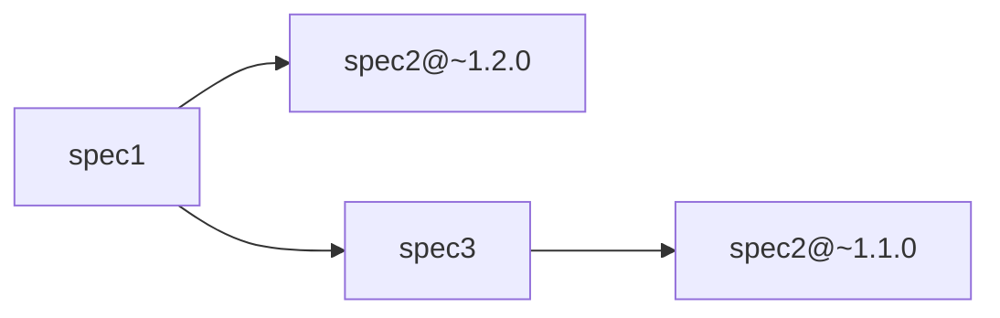
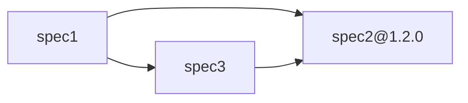

# Dependency Resolution Concept

## Overview

The `@ama-openapi/core` package provides a dependency management system for [OpenAPI specifications](https://www.openapis.org/). It allows you to:

- Specify OpenAPI model dependencies to used in a [manifest file](./MANIFEST_CONFIGURATION.md).
- Allow reference to models from external packages
- Apply transformations (masking, renaming, etc.) to imported external models
- Manage complex dependency relationships between OpenAPI specifications
- Handle multi in-depth versions, range versions and conflict resolution thanks to [NPM version mechanism](https://docs.npmjs.com/about-npm).

## Concept

The OpenAPI resolution mechanism is based on the [NPM package resolution](https://docs.npmjs.com/about-npm) on top of which it allows to reference and transform inner models.

### NPM package dependency

The usage of NodeJs greatly simplify the retrieval and versioning of specification.
Thanks to it, a [Renovate configuration](https://docs.renovatebot.com/configuration-options/) can be set to automatize the upgrade of specifications.

To depend on an OpenAPI package, the dependency can be added via the command:

```shell
npm install @my/dep-spec
```

> [!NOTE]
> An additional `npm install` may be required on certain version of `npm` to ensure the `postinstall` task to run.\
> `yarn` or `pnpm` can be used instead.

It will then appear in the `dependencies` field of `package.json` file.

Thanks to the NPM dependency mechanism, multi-artifact versions are fully supported and will be resolved according to [range intersection](https://www.geeksforgeeks.org/node-js/how-does-npm-handle-version-conflicts/).

For example:



Will bring the 2 versions of the `spec2` in the final bundle generated by [Redocly](https://redocly.com/) (as there is no intersection between `~1.1.0` and `~1.2.0`).

If needed, NPM offers the feature to enforce the version over the dependencies via the [overrides field](https://docs.npmjs.com/cli/v9/configuring-npm/package-json#overrides):

```json5
// in package.json
{
  "name": "my-specification",
  "dependencies": {
    "spec2": "~1.2.0",
    "spec3": "latest"
  },
  "overrides": {
    "spec2": "1.2.0"
  }
}
```

will result to a single version:



> [!IMPORTANT]
> The NPM dependency allow access to the models but to refer to a model in your specification they need to be listed in the [manifest file](./DEPENDENCY_RESOLUTION_CONCEPT.md#model-extraction).

> [!NOTE]
> More details regarding the dependency in `package.json` are available in the [Shareable specification section](./SHAREABLE_SPECIFICATION.md).

### Model extraction

Once the model package is available for NodeJs (cf. [NPM package dependency](./DEPENDENCY_RESOLUTION_CONCEPT.md#npm-package-dependency)), we need to extract the models to make them accessible from the specification files.

The dependency management system uses [manifest configuration files](./MANIFEST_CONFIGURATION.md) to define which OpenAPI should be reachable and how to process them.\
The extraction can then be processed by the command `ama-openapi install` from [@ama-openapi/cli package](https://www.npmjs.com/package/@ama-openapi/cli).

The process will then extract the models into the directory `models_external/` which can be referred in you specification

<details>

<summary>Example</summary>

The configs:

```json5
// in package.json
{
  "name": "specification",
  "dependencies": {
    "@ama-openapi/cli": "latest",
    "@my/specification-package": "*"
  }
}
```

```json5
// in openapi.manifest.json
{
  "models": {
    "@my/specification-package": {
      "path": "models/ExampleModel.v1.yaml",
      "transform": {
        "fileRename": "my-unique-spec.v1.yaml"
      }
  }
}
```

After running the command `ama-openapi install` we have the following file which is generated:

```yaml
# in models_external/my-specification-package/models/my-unique-spec.v1.yaml
title: Example
type: object
properties:
  field:
    type: string
    description: Sample data field
x-internal-source: "@my/specification-package/models/ExampleModel.v1.yaml"
x-internal-version: "1.2.3"
x-internal-masked: false
x-internal-touched: true
```

And we will then be able to refer to it in the local specification:

```yaml
# in models/my-model.yaml
type: object
properties:
  data:
    $ref: "../models_external/my-specification-package/models/my-unique-spec.v1.yaml"
```

</details>
