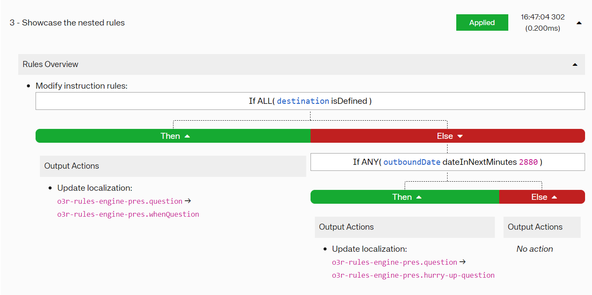

# Otter Rules Engine - Nested Condition Example

## Introduction

Let's check out how to set up your own nested actions. 

In this example, let's consider a hotel search form. The traveler chose a destination as well as the date of the first 
night.


We want to encourage the user to fill the form and ask them when they want to travel once they have filled the destination
input.


If a user forgot to input their destination but their vacation date is soon approaching, we want to update the instructions
to encourage them to book quickly.


This will result in a nested rule that will first check if the location is set and will then check if a departure date
has been set up before overriding the translations.



## Ruleset
```json5
{
  "schema": "https://raw.githubusercontent.com/AmadeusITGroup/otter/main/packages/%40o3r/rules-engine/schemas/rulesets.schema.json",
  "rulesets": [
    {
      "id": "6194b61a-1bf3-4c02-8b7c-20f782d68324",
      "name": 'Showcase the nested rules',
      "disabled": false,
      "rules": [
        {
          "id": "1467e501-b9ff-414f-8026-56885d0d7a4e",
          "name": "Modify instruction rules",
          "disabled": false,
          "outputRuntimeFacts": [],
          "inputRuntimeFacts": [],
          "rootElement": {
            "elementType": "RULE_BLOCK",
            "blockType": "IF_ELSE",
            "condition": {
              "all": [
                {
                  "lhs": {
                    "type": "FACT",
                    "value": "destination"
                  },
                  "operator": "isDefined"
                }
              ]
            },
            "successElements": [
              {
                "elementType": "ACTION",
                "actionType": "UPDATE_LOCALISATION",
                "key": "o3r-rules-engine-pres.question",
                "value": "o3r-rules-engine-pres.whenQuestion"
              }
            ],
            "failureElements": [
              {
                "elementType": "RULE_BLOCK",
                "blockType": "IF_ELSE",
                "condition": {
                  "any": [
                    {
                      "lhs": {
                        "type": "FACT",
                        "value": "outboundDate"
                      },
                      "rhs": {
                        "type": "LITERAL",
                        "value": "2880"
                      },
                      "operator": "dateInNextMinutes"
                    }
                  ]
                },
                "successElements": [
                  {
                    "elementType": "ACTION",
                    "actionType": "UPDATE_LOCALISATION",
                    "key": "o3r-rules-engine-pres.question",
                    "value": "o3r-rules-engine-pres.hurry-up-question"
                  }
                ],
                "failureElements": []
              }
            ]
          }
        }
      ]
    }
  ]
}
```
