# Rules Engine - Chrome Extension tab

The Otter Framework provides a [Chrome Extension](https://chromewebstore.google.com/detail/otter-devtools/aejabgendbpckkdnjaphhlifbhepmbne) to help you debug your Rulesets. 

## Activate the debug mode

The extension is only compatible with applications running with the debug mode of the Otter rules engine.
You can activate it via the `forRoot` method of the rules engine module:

```typescript
import {inject, runInInjectionContext} from '@angular/core';
import {OTTER_RULES_ENGINE_DEVTOOLS_OPTIONS, RulesEngineRunnerModule, RulesEngineDevtoolsModule, RulesEngineDevtoolsMessageService} from '@o3r/rules-engine';
import {AppComponent} from './app.component';

bootstrapApplication(AppComponent, {
  imports: [
    RulesEngineDevtoolsModule,
    RulesEngineRunnerModule.forRoot({debug: true}) // Activate rule engine debug mode
  ],
  declarations: [AppComponent],
  bootstrap: [AppComponent],
  providers: [
    {provide: OTTER_RULES_ENGINE_DEVTOOLS_OPTIONS, useValue: {isActivatedOnBootstrap: true}}
  ]
})
  .then((m) => {
    runInInjectionContext(m.injector, () => {
      inject(RulesEngineDevtoolsMessageService)
    });
  })
  // eslint-disable-next-line no-console
  .catch(err => console.error(err));

```

If you forgot to activate the rules engine debug mode, you will not be able to interact with the panel.

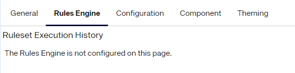

## Ruleset History
The Chrome Extension has a dedicated tab for your rulesets debugging. It displays a view listing all ruleset executions, 
from the most recent to the oldest.
If your ruleset has never been executed, you will not find it here.

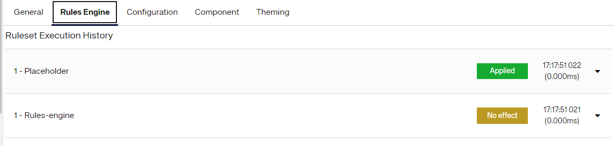

The list is reactive. Its content will be updated whenever a new execution has been processed.

A rule execution can result in one of these four possible states:
* Deactivated: A Ruleset that has already resulted in a list of actions, but that is now deactivated because it is linked 
  to a component that is no longer part of the page. The actions have been fallen back.
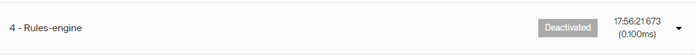
* Applied: A ruleset that resulted in a list of actions that are still active (all the conditions on linked components or 
validity dates are met)
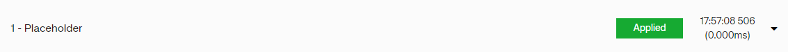
* Ruleset with no effect: A ruleset execution that did not fail but that did not result in any actions after execution.
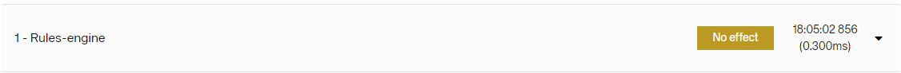
* Failed ruleset: A ruleset execution that resulted in an error. The output actions will not be applied.
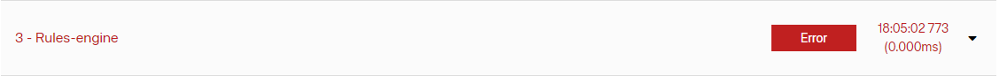

> [!WARNING]
> If a Ruleset has never been executed because its linked components and its validity range conditions have never been met,
> the Ruleset will not be part of the list. It will not be shown as deactivated.

## Ruleset overview
You can expand a ruleset execution to find more information on the mentioned execution.

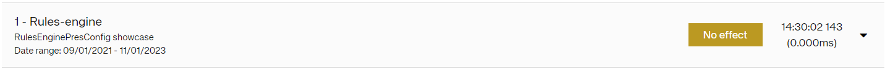

The collapsed view will provide some basic information on your ruleset execution:
* Ruleset execution counter: the index of the execution within all the ruleset executions. A '1' indicates that this 
is the first execution for this ruleset. 
* Human-readable Ruleset name: it corresponds to the `name` Ruleset property but will transform '-' into spaces for
readability reasons. 
* Execution timestamp 
* Expand / collapse button to show more details on the execution 
* Status capsule as explained in the previous section
* Validity date range when the ruleset will be applied
* Linked component that controls the activation of a ruleset

## Ruleset details

The expanded view provides much more details to debug your rule:
* Rules overview: Collapsed by default as it can take a lot of screen space. It describes the list of rules defined in 
the ruleset with the different conditions and resulting actions.
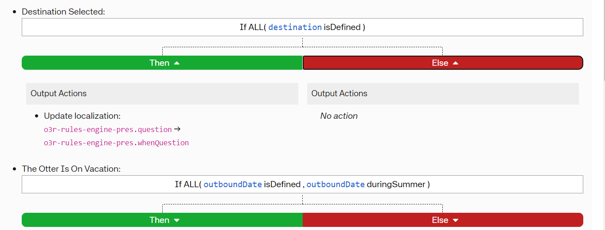

> [!WARNING]
> This view is only a description of the rules and not the resulting actions.

> [!INFO]
> A rule can result in another rule
> 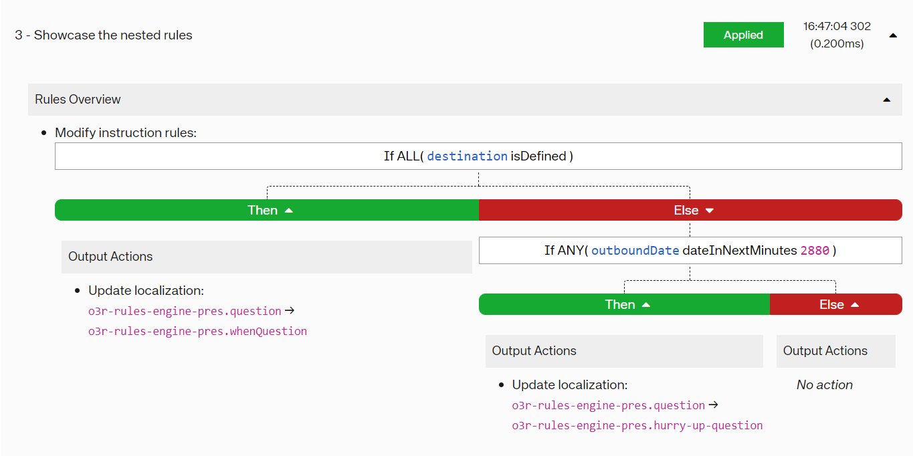

* Inputs snapshot: Lists all the inputs involved in the ruleset and their values at the time of the execution. Note that
this contains both the application facts and the temporary inputs scoped to the Ruleset. 
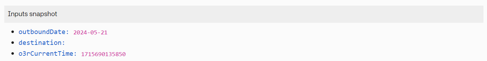
* Output actions: Lists the actions triggered by the ruleset / rule execution.
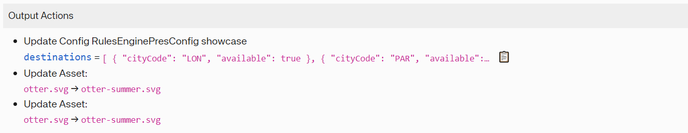
* Executed rules overview
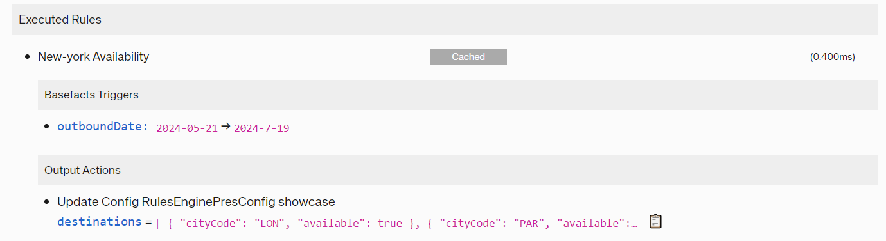
  * Basefact triggers: Lists the input fact changes that triggered the rule execution.
  * Cached rule: Identifies rules that were not re-executed. The output has been cached during a previous 
  execution.

The detailed view differs a bit for failed rulesets as no action will be triggered after the rule execution.


Failed rules are identified by a red 'Error' capsule.
The output list is replaced with the error message in the Rules Evaluation section.

In case a rule resulted in an error, there will be no output actions resulting from the Ruleset execution. Hence, all
override actions will be removed from the list of resulting actions.

However, the error may come from one of the temporary facts set in one of the rules. 
For this reason, the actions impacting the Ruleset temporary facts that have been run successfully will be displayed.
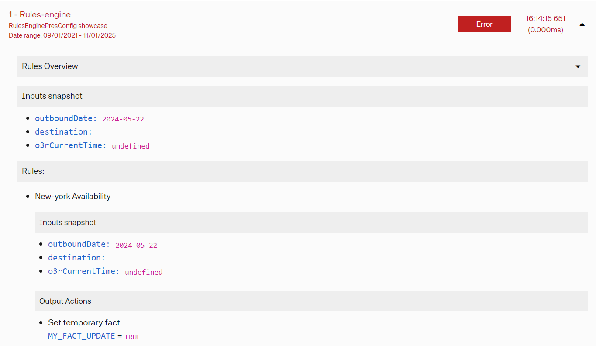

