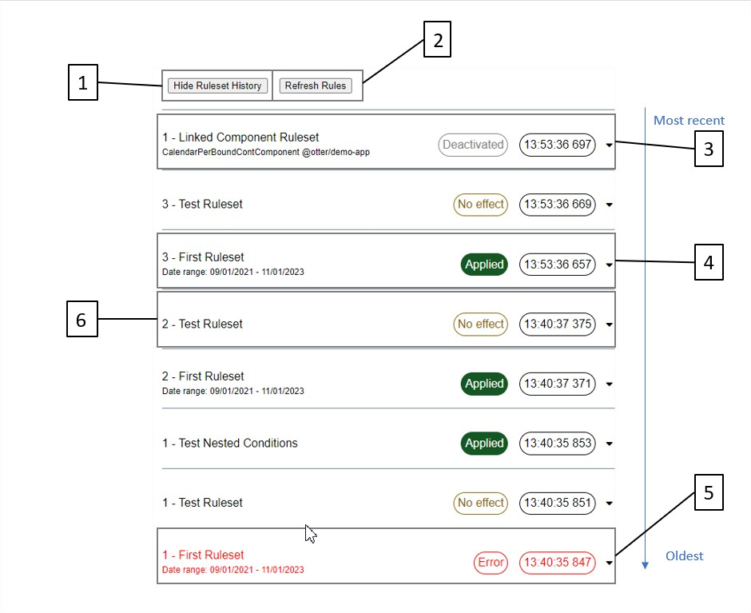
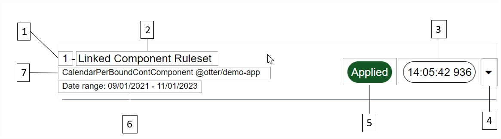
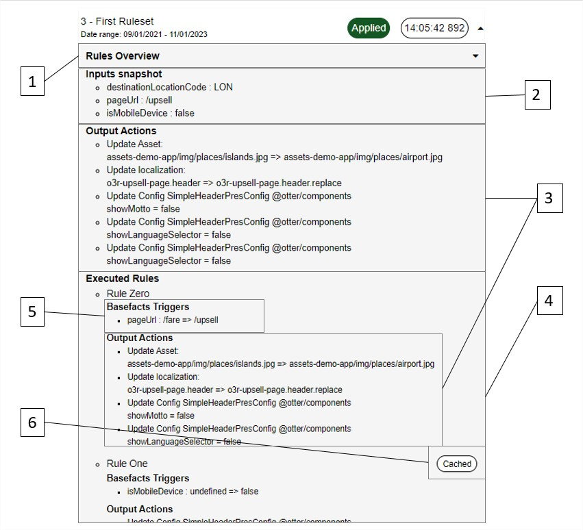
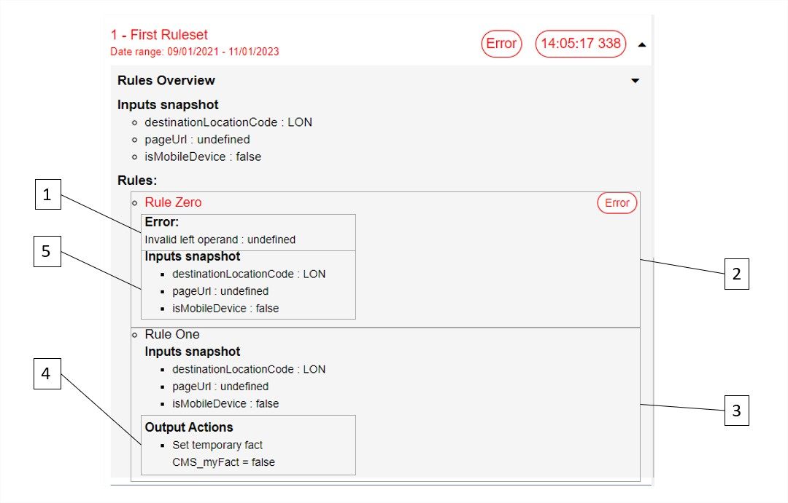
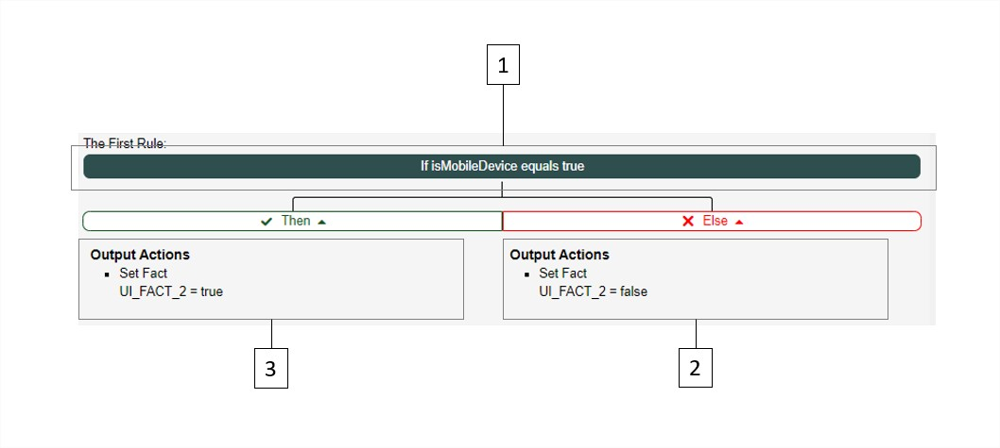
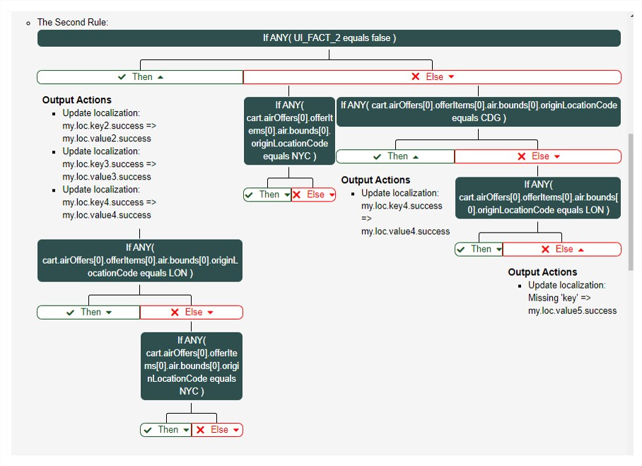

# Debug panel

The ___DebugPanelPresComponent___ contains a whole section dedicated to the debug of the rules engine.
This section is only available if you have activated the debug mode on the import of the rules engine module:

```typescript
import {NgModule} from '@angular/core';
import {RulesEngineRunnerModule, RulesEngineDevtoolsModule} from '@o3r/rules-engine';
import {AppComponent} from './app.component';

@NgModule({
    imports: [
      RulesEngineDevtoolsModule,
      RulesEngineRunnerModule.forRoot({debug: true}) // Activate rule engine debug mode
    ],
    declarations: [AppComponent],
    bootstrap: [AppComponent]
})
export class AppModule {}
```

If you forgot to activate the rules engine debug mode, you will not be able to interact with the panel.


## Ruleset History
'Show Ruleset History' will display a view with the list of all the ruleset execution order from the most recent to the 
oldest one. If your ruleset has never been executed, you will not find it here.



You can hide or show the panel with the Rule History Toggle (1) and refresh the result with the Refresh Rules button (2).

The list is not dynamically updated. The content will only be updated if the user toggled the panel or if they manually 
refresh the rules.

There are 4 state possible for a rule execution
* Deactivated (3): A ruleset that resulted in a list of actions but that is linked to a component that is no longer active.
  The actions have been fallen back.
* Applied (4): A ruleset that resulted in a list of actions still active (no linked components, date in validity range or 
  linked component still active) 
* Ruleset with no effect(5): A ruleset execution that did not fail but that did not result in any actions after execution.
* Failed ruleset (6): A ruleset execution that resulted in an error. The output actions will not be applied.

## Ruleset overview
You can expand a ruleset execution to find more information on mentioned execution.



The collapsed view will provide some basic information on your ruleset execution:
1. Ruleset execution counter: the index of the execution within all the ruleset executions. A '1' indicates that this 
is the first execution for this ruleset
2. Ruleset name: as defined in AEM
3. Execution timestamp
4. Expand / collapse button to show more details on the execution
5. Status capsule as explained in the previous section
6. Validity date range when the ruleset will be applied
7. Linked component that control the activation of a ruleset

## Ruleset details



The expanded view provides much more details to debug your rule:
1. Rules overview: Collapsed by default as it can take a lot of screen space. It describes the list of rules defined in 
the ruleset
2. Inputs snapshot: list of inputs involved in the ruleset and their value at the time of the execution
3. Output actions: list of actions triggered by the ruleset / rule execution
4. Executed rules overview
5. Basefact triggers: list of input fact changes that triggered the rule execution
6. Cached rule: only displayed in the case the rule was not re-executed. The output has been cached during a previous 
execution

The detailed view differs a bit for failed ruleset as no action will be triggered after the rule execution.



The output list is replaced with the error message (1) in the Rules Evaluation section.
Failed rules are identified with a 'Error' capsule and red text (2).


The override actions in the output will not be applied if any ruleset rule met an error but temporary facts might be 
involved in the error that occurred.
Hence, non-failed rules (3) will only display the output actions that impact the ruleset temporary facts (4).

The input snapshot has been enhanced to also show the temporary facts used as runtime inputs (5).

## Rules overview
The rule overview panel provide a reminder on the rule definitions.



It contains the following elements:
1. The rule condition that will be evaluated
2. The collapsible list of actions triggered in case the condition is not met
3. The collapsible list of actions triggered in case the condition is met

__Note:__ This view does not show which rules have been evaluated. It only serves a quick description of the rule as 
defined in AEM.

__Note:__ The rule are recursive, this means that a new rule can be executed as a result of the condition evaluation.
This is reflected in the overview as such rule will be displayed as a tree.


