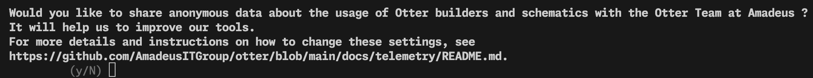
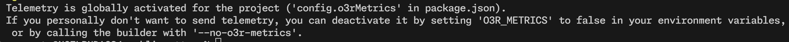

# Telemetry Privacy Notice

The Amadeus Otter team has put in place a telemetry service to collect and analyze technical information about how its open-source builders and schematics are used.

The data collected will be used to help the Otter Team to prioritize features and improvements on the Otter builder and schematics capabilities.

## How to provide the consent?

At the next usage of builder/schematic, you will be prompted to provide or deny your consent:

In case the consent is given for the whole project and on behalf of all project members, each user will be warned that the consent has been provided for the project and the means to deactivate it.

## How is the data collected?

Once the consent is provided the Amadeus Otter Team will send the command-line command usage statistics to collect the technical information.

## What is collected?

Usage analytics may include the following information:
- Your operating system (macOS, Linux distribution, Windows) and its version.
- Package manager name and version (local version only).
- Node.js version (local version only).
- Otter version (local version only).
- Command name that was run.
- The time it took to run.
- Project name.
- The schematic/builder options.
- IP address

> [!NOTE]
> The IP address is only collected for security purposes and won’t be used as part of the analytics data.
> The IP address is kept for one month and at the end of the retention period, the data is permanently deleted.

## How to withdraw your consent?

To withdraw your consent, you can either:
- set `config.o3rMetrics` to false in your `package.json` to disable the consent for the whole project; or
- set `O3R_METRICS` to `false` in your environment variables in your machine; or
- By calling the builder/schematic with `--no-o3r-metrics`.
