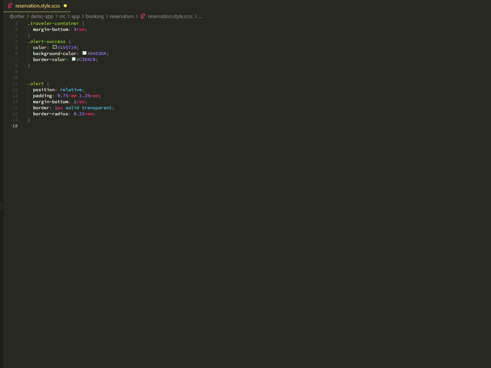
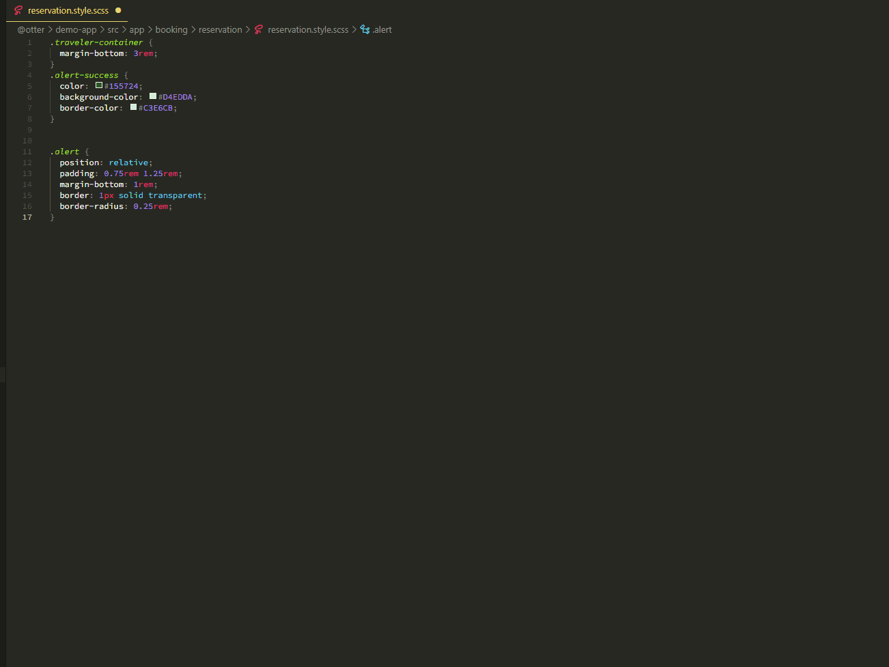

# Otter Extract Styling to o3r.variable

Add commands to extract scss properties into Otter variables

## Features

### Extract a single variable



### Extract all variables



### Commands

- `Otter: Extract SCSS property to o3r.variable` : extract a single pair property/value into an otter variable

> must be on the line on which you want to perform the command

- `Otter: Extract all SCSS properties to o3r.variable` : extract all the matches properties and values into otter variables

### Extension Settings

This extension can be configured the following settings:

- `otter.extract.styling.forbiddenWords`: Array of words to exclude from the final result of a generated variable
- `otter.extract.styling.prefix`: If not empty, will add a prefix to all the generated variables.

## Example

Before

```scss
// in app-header.scss file
.app-header-class {
  .title-text {
    color: red;
  }
}
```

Use the command `Otter: Extract SCSS property to o3r-var` where the cursor is set
> must be on the line on which you want to perform the command

After

```scss
// in app-header.scss file
@use "@o3r/styling" as o3r;
$app-header-title-text-color: o3r.variable("app-header-title-text-color", red);

.app-header-class {
  .title-text {
    color: $app-header-title-text-color;
  }
}
```

with the following configuration

```json5
"otter.extract.styling.prefix": "app" // default: ""
```
