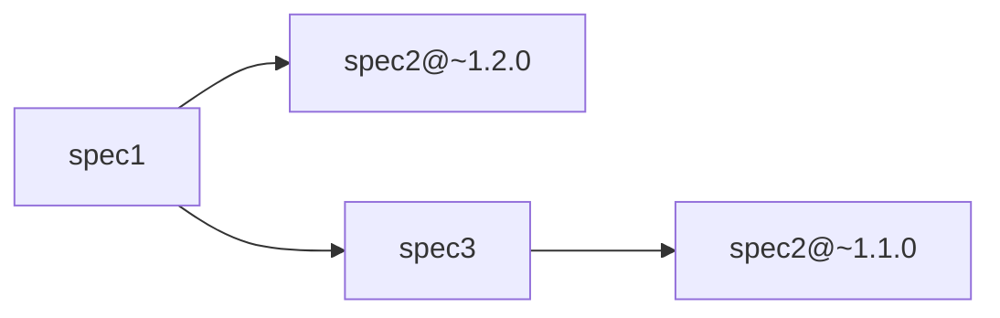
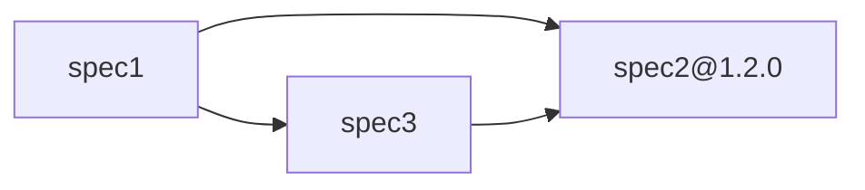

# @ama-openapi/core

A core package for managing OpenAPI dependencies and specifications in JavaScript/TypeScript projects. This package provides essential functionalities such as the download, process, and installation of OpenAPI model dependencies with support for transformations and advanced dependency management.

The goal is to ensure dependencies in a ecosystem of specification and allow their bundling via the [Redocly bundle command](https://redocly.com/docs/cli/commands/bundle).

> [!TIP]
> This package exposes the function `installDependencies` used internally by the [ama-openapi CLI](https://npmjs.com/package/@ama-openapi/cli) and [Redocly Plugin](https://npmjs.com/package/@ama-openapi/redocly-plugin).\
> It **may not be required** as dependency in standard OpenAPI project.

**Table of contents:**

- [@ama-openapi/core](#ama-openapicore)
  - [Overview](#overview)
  - [Dependency resolution Concept](#dependency-resolution-concept)
    - [NPM package dependency](#npm-package-dependency)
    - [Model extraction](#model-extraction)
  - [Transforms](#transforms)
    - [Definition of a transform](#definition-of-a-transform)
    - [Mask Features](#mask-features)
  - [Extracted model details](#extracted-model-details)
    - [Reference only](#reference-only)
    - [Transformed model](#transformed-model)
    - [Model annotations](#model-annotations)
  - [Manifest Configuration](#manifest-configuration)
    - [Manifest Schema](#manifest-schema)
  - [Shareable specification](#shareable-specification)
    - [Shareable specification exposition](#shareable-specification-exposition)
    - [Shareable specification external references](#shareable-specification-external-references)
  - [Technical information](#technical-information)
    - [Schema Validation](#schema-validation)
    - [Renovate configuration](#renovate-configuration)
    - [Custom installer](#custom-installer)
  - [Integration](#integration)

## Overview

The `@ama-openapi/core` package provides a dependency management system for [OpenAPI specifications](https://www.openapis.org/). It allows you to:

- Specify OpenAPI model dependencies to used in a [manifest file](#manifest-configuration).
- Allow reference to models from external packages
- Apply transformations (masking, renaming, etc.) to imported external models
- Manage complex dependency relationships between OpenAPI specifications
- Handle multi in-depth versions, range versions and conflict resolution thanks to [NPM version mechanism](https://docs.npmjs.com/about-npm).

## Dependency resolution Concept

The OpenAPI resolution mechanism is based on the [NPM package resolution](https://docs.npmjs.com/about-npm) on top of which it allows to reference and transform inner models.

### NPM package dependency

The usage of NodeJs greatly simplify the retrieval and versioning of specification.
Thanks to it, a [Renovate configuration](https://docs.renovatebot.com/configuration-options/) can be set to automatize the upgrade of specifications.

To depend on an OpenAPI package, the dependency can be added via the command:

```shell
npm install @my/dep-spec
```

> [!NOTE]
> An additional `npm install` may be required on certain version of `npm` to ensure the `postinstall` task to run.\
> `yarn` or `pnpm` can be used instead.

It will then appear in the `dependencies` field of `package.json` file.

Thanks to the NPM dependency mechanism, multi-artifact versions are fully supported and will be resolved according to [range intersection](https://www.geeksforgeeks.org/node-js/how-does-npm-handle-version-conflicts/).

For example:



Will bring the 2 versions of the `spec2` in the final bundle generated by [Redocly](https://redocly.com/) (as there is no intersection between `~1.1.0` and `~1.2.0`).

If needed, NPM offers the feature to enforce the version over the dependencies via the [overrides field](https://docs.npmjs.com/cli/v9/configuring-npm/package-json#overrides):

```json5
// in package.json
{
  "name": "my-specification",
  "dependencies": {
    "spec2": "~1.2.0",
    "spec3": "latest"
  },
  "overrides": {
    "spec2": "1.2.0"
  }
}
```

will result to a single version:



> [!IMPORTANT]
> The NPM dependency allow access to the models but to refer to a model in your specification they need to be listed in the [manifest file](#model-extraction).

> [!NOTE]
> More details regarding the dependency in `package.json` are available in the [Shareable specification section](#shareable-specification).

### Model extraction

Once the model package is available for NodeJs (cf. [NPM package dependency](#npm-package-dependency)), we need to extract the models to make them accessible from the specification files.

The dependency management system uses [manifest configuration files](#manifest-configuration) to define which OpenAPI should be reachable and how to process them.\
The extraction can then be processed by the command `ama-openapi install` from [@ama-openapi/cli package](https://www.npmjs.com/package/@ama-openapi/cli).

The process will then extract the models into the directory `models_external/` which can be referred in you specification

<details>

<summary>Example</summary>

The configs:

```json5
// in package.json
{
  "name": "specification",
  "dependencies": {
    "@ama-openapi/cli": "latest",
    "@my/specification-package": "*"
  }
}
```

```json5
// in openapi.manifest.json
{
  "models": {
    "@my/specification-package": {
      "path": "models/ExampleModel.v1.yaml",
      "transform": {
        "fileRename": "my-unique-spec.v1.yaml"
      }
  }
}
```

After running the command `ama-openapi install` we have the following file which is generated:

```yaml
# in models_external/my-specification-package/models/my-unique-spec.v1.yaml
title: Example
type: object
properties:
  field:
    type: string
    description: Sample data field
x-internal-source: "@my/specification-package/models/ExampleModel.v1.yaml"
x-internal-version: "1.2.3"
x-internal-masked: false
x-internal-touched: true
```

And we will then be able to refer to it in the local specification:

```yaml
# in models/my-model.yaml
type: object
properties:
  data:
    $ref: "../models_external/my-specification-package/models/my-unique-spec.v1.yaml"
```

</details>

## Transforms

Before being exposed to be used by your specifications, a dependency model can be transformed via options defined in the [manifest configuration](#manifest-configuration).\
The following transformation are available:

| Transform name | Description |
| --- | --- |
| `fileRename` | Allow renaming a model file name and allow referring the original name with the keyword `$1`. <br /> *Example: `"myPrefix_$1"` will prefix the model.* <br /> Note that the filename is used by [Redocly bundle](https://redocly.com/docs/cli/commands/bundle) to generate the final model name. |
| `titleRename` | Allow renaming a model title name and allow referring the original name with the keyword `$1`.<br /> *Example: `"myPrefix_$1"` will prefix the model title.* Note that the field `title` is ignored by Redocly. |
| `mask` | Mask to apply to the model as [defined in stoplight](https://meta.stoplight.io/docs/platform/2nebi9gb2ankj-override-model-properties) |

### Definition of a transform

There are 2 ways to define a transform for a specific model.

1. Directly inside the [manifest file](#manifest-configuration) like in the following example:

```yaml
# in openapi.manifest.yaml
models:
  "@my/specification-package":
    path: "models/ExampleModel.v1.yaml"
    transform:
      fileRename: "new-model-name.json"
      mask:
        properties:
          field1:
```

2. In a dedicated file:

```yaml
# in openapi.manifest.yaml
models:
  "@my/specification-package":
    path: "models/ExampleModel.v1.yaml"
    transform: "./transform-example.yaml"
```

```yaml
# in openapi.manifest.yaml
fileRename: "new-model-name.json"
mask:
  properties:
    field1:
```

> [!TIP]
> Both `json` and `yaml` format files are supported.

### Mask Features

The mask feature offers 4 main capabilities:

- Filter the fields of a model object `properties`
- Override object property's value
- Add object property
- Be applied on referenced objects

<details>

<summary>Example</summary>

For the following models:

```yaml
# in models/example.v1.yaml
type: object
properties:
  field1:
    type: string
    description: my first string
  field2:
    type: string
    description: my other string
  uselessField:
    type: string
  field3:
    $ref: ./sub-example.v1.yaml
```

and

```yaml
# in models/sub-example.v1.yaml
type: object
properties:
  subField1:
    type: string
    description: my first string
  subField2:
    type: string
```

The following mask:

```yaml
property:
  field1:
  field2:
    description: "my second string"
  field3:
    property:
      subField1:
```

will result to:

```yaml
# in model_external/models/example.v1.yaml
type: object
properties:
  field1:
    type: string
    description: my first string
  field2:
    type: string
    description: my second string # overrided
  field3:
    $ref: ./example.v1/models/sub-example.v1.yaml
```

```yaml
# in model_external/models/example.v1/models/sub-example.v1.yaml
type: object
properties:
  subField1:
    type: string
    description: my first string
```

</details>

## Extracted model details

As described in the [dependency resolution section](#dependency-resolution-concept), the external dependency models are extracted in the `models_external` directory to be referred by your local specification files.

The purposes of this mechanism are the following:

- Be agnostic of NodeJs package manager mechanism (and support `plug'n'play` module resolution)
- Allow the application of [transforms](#transforms) on top of definitions
- Support linking the `$ref` to the referred definition (thanks to [VsCode OpenApi extension](https://marketplace.visualstudio.com/items?itemName=42Crunch.vscode-openapi))
- Support of version overrides when exposed as dependencies.

### Reference only

When there is no `transform` applied to the external model, the only purpose of the model file generated in `models_external` is to redirect to the correct dependency path (concretely in `node_module`).\
To simplify, only a `$ref` will be printed in the file, as following:

```json5
// in openapi.manifest.json
{
  "models": {
    "@my/spec": "models/example.v1.yaml"
  }
}
```

will generate the file:

```yaml
# in models_external/my-spec/models/example.v1.yaml
x-internal-reference-generated: true
$ref: ../../../node_modules/@my/spec/models/example.v1.yaml
x-internal-source: '@my/spec/models/example.v1.yaml'
x-internal-version: '1.2.0'
x-internal-masked: false
x-internal-touched: false
```

### Transformed model

A transform model is a model generated in `models_external` directory on which one or several [transforms](#transforms) have been applied.\
The model will also include additional [annotations](#model-annotations) according to the updated parts.

> [!NOTE]
> When multiple transform sets are applied to a single model, this will result into multiple model files generated in `models_external`. See [manifest examples](#manifest-schema) for more details.

### Model annotations

The following annotations, via [x-vendor](https://swagger.io/docs/specification/v3_0/openapi-extensions/) fields, are added to the models extracted to the `models_extrenal` directory:

| Annotation | Position | Description |
| --- | --- | --- |
| `x-internal-masked` | model root | Indicates that the model has been masked |
| `x-internal-touched` | model root | Indicates that the model has be modified by any [transform](#transforms) |
| `x-internal-source` | model root | original model reference before transformation |
| `x-internal-version` | model root | Version of the artifact exposition the original model |
| `x-internal-reference-rewritten` | beside `$ref` node | Indicates that the associated `$ref` value has been updated |
| `x-internal-reference-generated` | beside `$ref` node | Indicates that the associated `$ref` has been generated and target a local file |

## Manifest Configuration

The dependency management system uses manifest files to define which OpenAPI models to include and how to process them. The package looks for manifest files in the following order:

- `ama-openapi.manifest.json`
- `ama-openapi.manifest.yaml`
- `ama-openapi.manifest.yml`
- `openapi.manifest.json`
- `openapi.manifest.yaml`
- `openapi.manifest.yml`

> [!TIP]
> In case no valid file from previous the list is found, the mechanism will parse the `package.json` to find manifest definitions.

### Manifest Schema

The manifest file follows a [specific schema](./schemas/manifest.schema.json) that list the referenceable models and the transforms applied to it.

**Examples:**

<details>

<summary>Single model</summary>

```json5
{
  "models": {
    "@my/specification-package": "models/ExampleModel.v1.yaml"
  }
}
```

Equivalent to:

```json5
{
  "models": {
    "@my/specification-package": {
      "path": "models/ExampleModel.v1.yaml"
    }
  }
}
```

</details>

<details>

<summary>Default package bundled specification</summary>

```json5
{
  "models": {
    "@my/specification-package": true
  }
}
```

</details>

<details>

<summary>Rename definition</summary>

```json5
{
  "models": {
    "@my/specification-package": {
      "path": "models/ExampleModel.v1.yaml",
      "transform": {
        "fileRename": "MyPrefix_$1",
      }
    }
  }
}
```

> [!NOTE]
> The keyword `$1` allows referencing the original file name. In this example, the final file will be `MyPrefix_ExampleModel.v1.yaml`.

</details>

<details>

<summary>Apply a single mask</summary>

```json5
{
  "models": {
    "@my/specification-package": {
      "path": "models/ExampleModel.v1.yaml",
      "transform": {
        "fileRename": "transformed_$1",
        "titleRename": "transformed_$1",
        "mask": {
          "properties": {
            "field": true
          }
        }
      }
    }
  }
}
```

</details>

<details>

<summary>Multiple mask for a single model</summary>

```json5
{
  "models": {
    "@my/specification-package": [
      {
        "path": "models/ExampleModel.v1.yaml",
        "transform": {
          "fileRename": "transformed1_$1",
          "mask": {
            "properties": {
              "field": true
            }
          }
        }
      },
      {
        "path": "models/ExampleModel.v1.yaml",
        "transform": {
          "fileRename": "transformed2_$1",
          "mask": {
            "properties": {
              "other": true
            }
          }
        }
      }
    ]
  }
}
```

</details>

## Shareable specification

As the dependency system is based on NPM packages, a shareable specification should follow the requirements of an NPM package:

1. A `package.json` should be provided and exposed the files accessible by the consumer
2. The package should be published to an NPM registry thanks to the command `npm publish`
3. The relative references of the different models should be rewritten to target the same model from a different location.

### Shareable specification exposition

The `package.json` exposing the specification should have the following characteristics:

- A `name` and valid `version`.
- Exposing the models via the [exports field](https://docs.npmjs.com/cli/v11/configuring-npm/package-json#exports).

<details>

<summary>Example</summary>

```json5
// package.json
{
  "name": "@my-scope/spec",
  "version": "1.0.0",
  "exports": {
    "./package.json": "./package.json",
    "./models/*": "./models/*",
    ".": {
      "json": "./bundle/specification.json",
      "yaml": "./bundle/specification.yaml",
      "default": "./bundle/specification.yaml",
    },
  }
}
```

</details>

### Shareable specification external references

To ensure that the external references will be resolvable by the [Redocly bundle](https://redocly.com/docs/cli/commands/bundle) process when the consumer will reference one of your models, the following steps are required:

- The external references should target exclusively URL or files in `models_external/` directory.
- The package of externally referred models should be listed in the `dependencies` or the `package.json`
- The external models are extracted during the `postinstall` lifecycle of your package.

<details>

<summary>Example</summary>

```json5
// in package.json
{
  "name": "@my-scope/spec",
  "version": "1.0.0",
  "scripts": {
    "postinstall": "ama-openapi install" // generating the folder `models_external/`
  },
  "dependencies": {
    "@ama-openapi/cli": "latest",
    "@my-scope/other-spec": "^1.1.0"
  },
  "exports": {
    // ...
  },
  "models": {
    "@my-scope/other-spec": "models/share-model.yaml"
  }
}
```

```yaml
# in your models/example.v1.yaml
title: Example
type: object
properties:
  field:
    $ref: "../models_external/my-scope-other-spec/models/share-model.yaml"
```

</details>

> [!TIP]
> More details in [ama-openapi CLI documentation](https://github.com/AmadeusITGroup/otter/tree/main/packages/@ama-openapi/cli#expose-shareable-models).

## Technical information

### Schema Validation

The package includes 2 JSON Schema which can be used to validate configurations. The schemas are the following:

- A JSON Schema to validate [Manifest configuration](#manifest-configuration) is available at: [@ama-openapi/core/schemas/manifest.schema.json](./schemas/manifest.schema.json).
- A JSON Schema to validate the [Transform files](#transforms) is available at: [@ama-openapi/core/schemas/transform.schema.json](./schemas/transform.schema.json).

You can use these schemas in your IDE or build tools to get validation and autocomplete support for manifest files.

> [!NOTE]
> The project generator [@ama-openapi/create](https://www.npmjs.com/package/@ama-openapi/create) prepares the manifest configuration file (and `package.json`) to refer the `manifest.schema.json`.

### Renovate configuration

The package exposes a Renovate preset to help upgrade and consolidate dependencies related to the Ama OpenAPI ecosystem at: [@ama-openapi/core/renovate/default.json](./renovate/default.json).

It can be imported with:

```json5
// in renovate.json
{
  "$schema": "https://docs.renovatebot.com/renovate-schema.json",
  "extends": [
    "github>AmadeusITGroup/otter//packages/@ama-openapi/core/renovate"
  ]
}
```

### Custom installer

Instead of using the default CLI from [@ama-opanapi/cli](https://www.npmjs.com/package/@ama-openapi/cli), a custom installer can be implemented locally using the function `installDependencies` exposed by this package:

```typescript
// in a any .mts file
import { installDependencies } from '@ama-openapi/core';

/** Example of options */
const options: {
  cwd: process.cwd()
  logger: console
};

await installDependencies(options);
```

## Integration

This Redocly Plugin is designed to work with the following tools:

- [@ama-openapi/redocly-plugin](https://www.npmjs.com/package/@ama-openapi/redocly-plugin) - Redocly CLI integration
- [@ama-openapi/cli](https://www.npmjs.com/package/@ama-openapi/cli) - Command to manually retrieve the dependencies
- [@ama-openapi/create](https://www.npmjs.com/package/@ama-openapi/create) - Project scaffolding tool
